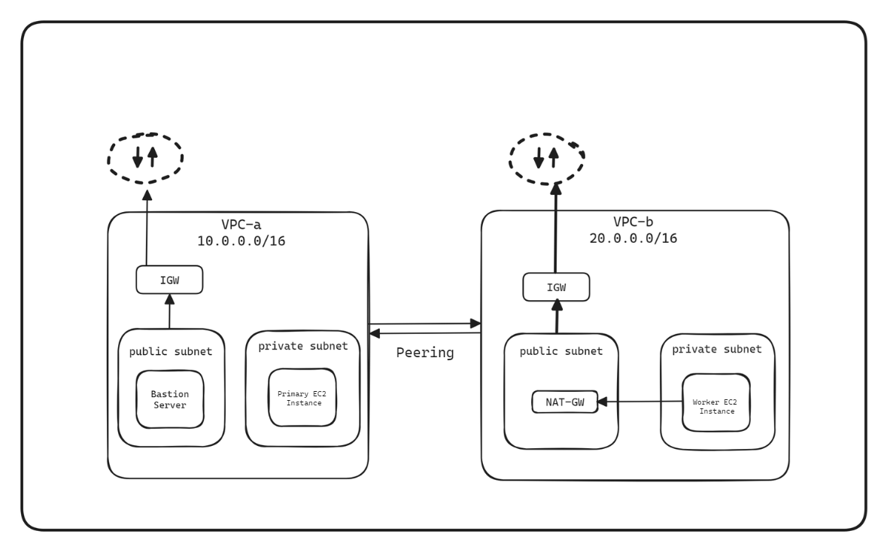

# AWS VPC Peering
 
### Desciption: 
1. Create two VPCs:
  - Establish peering connection between them.
  - Create public and private subnets.
  - Create Internet and NAT gateways.
  - Create route tables and associatiate them with specefic subnets/
2. Set up three EC2 instances, each in a separate VPC. 
  - Keep the bastion instance under public subnet.
  - Keep the primary and worker instance under private subnet of their specefic VPCs.

 

  
  <em>VPC Peering Connection</em>

 